# HW5 – Database and API Design

---

## 175. Combine Two Tables

```sql
SELECT p.firstName, p.lastName, a.city, a.state
FROM Person p
LEFT JOIN Address a ON p.personId = a.personId;
```

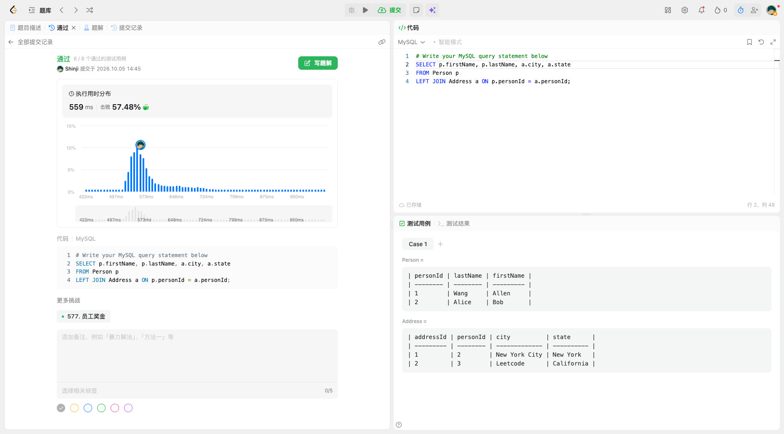

---

## 176. Second Highest Salary

```sql
SELECT (
    SELECT DISTINCT salary
    FROM Employee
    ORDER BY salary DESC
    LIMIT 1 OFFSET 1
) AS SecondHighestSalary;
```

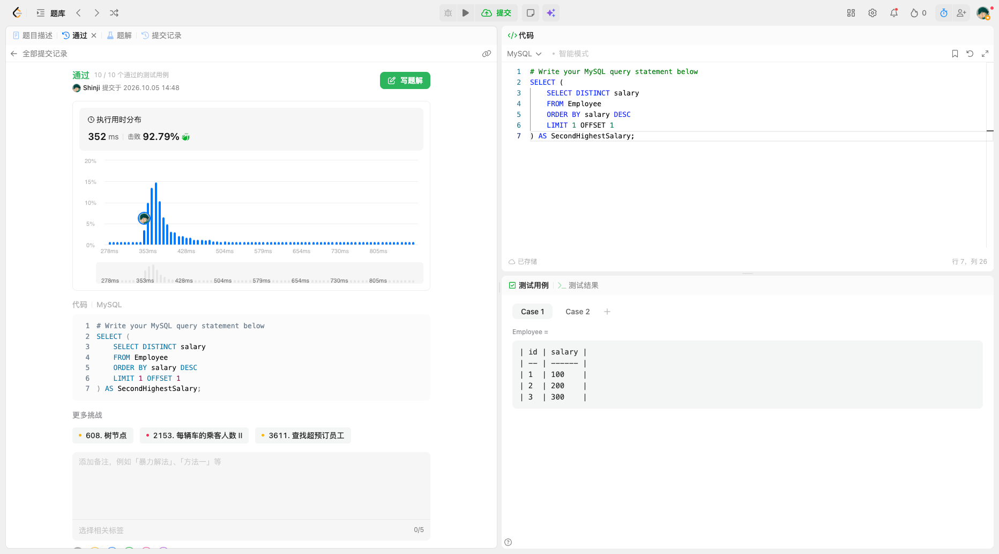

---

## 1757. Recyclable and Low Fat Products

```sql
SELECT product_id
FROM Products
WHERE low_fats = 'Y' AND recyclable = 'Y';
```

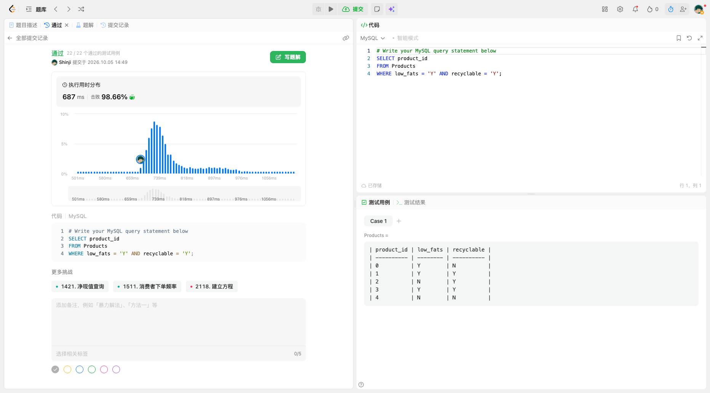

---

## 181. Employees Earning More Than Their Managers

```sql
SELECT e.name AS Employee
FROM Employee e
JOIN Employee m ON e.managerId = m.id
WHERE e.salary > m.salary;
```

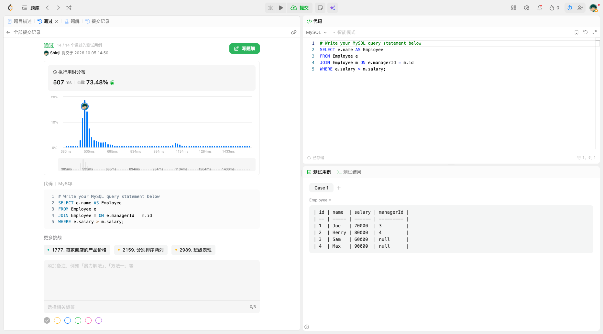

---

## 180. Consecutive Numbers

```sql
SELECT DISTINCT l1.num AS ConsecutiveNums
FROM Logs l1
JOIN Logs l2 ON l2.id = l1.id + 1 AND l2.num = l1.num
JOIN Logs l3 ON l3.id = l1.id + 2 AND l3.num = l1.num;
```

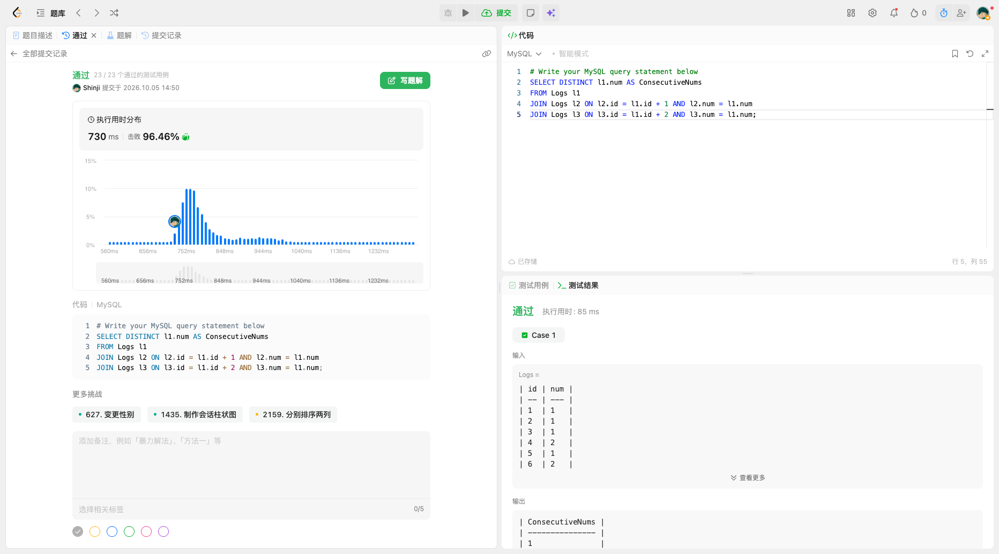

---

## 196. Delete Duplicate Emails

```sql
DELETE p1
FROM Person p1
JOIN Person p2 ON p1.email = p2.email AND p1.id > p2.id;
```

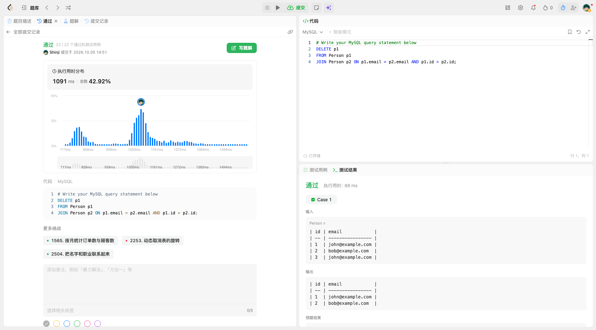

---

## 183. Customers Who Never Order

```sql
SELECT c.name AS Customers
FROM Customers c
LEFT JOIN Orders o ON o.customerId = c.id
WHERE o.id IS NULL;
```

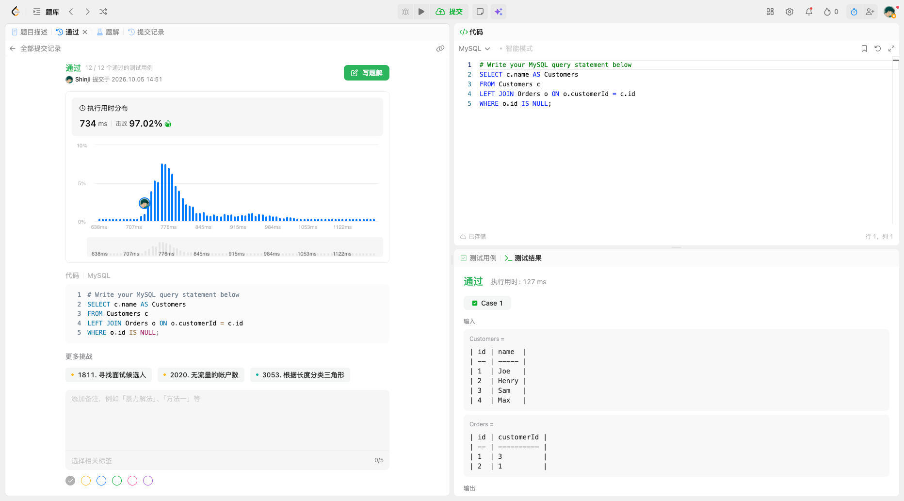

---

## 584. Find Customer Referee

```sql
SELECT name
FROM Customer
WHERE referee_id IS NULL OR referee_id <> 2;
```

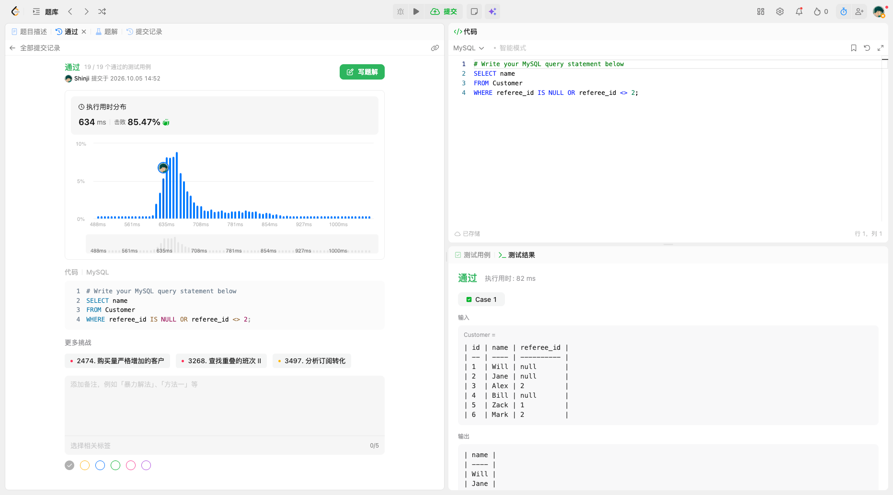

---

## 595. Big Countries

```sql
SELECT name, population, area
FROM World
WHERE area >= 3000000 OR population >= 25000000;
```

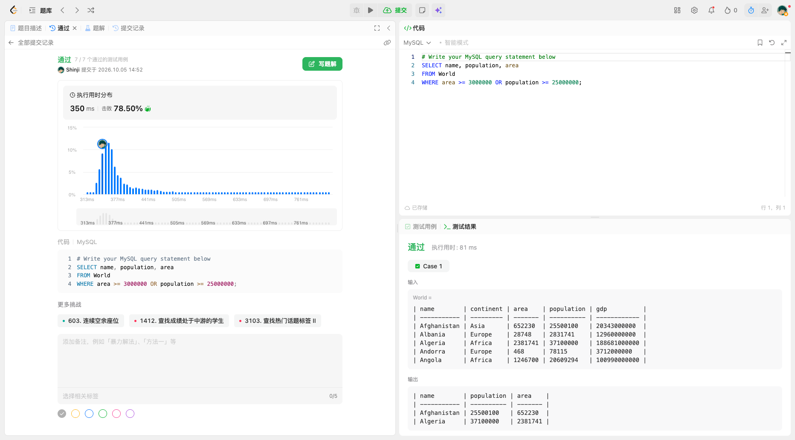

---

## 184. Department Highest Salary

```sql
SELECT d.name AS Department, e.name AS Employee, e.salary AS Salary
FROM Employee e
JOIN Department d ON e.departmentId = d.id
WHERE (e.departmentId, e.salary) IN (
    SELECT departmentId, MAX(salary)
    FROM Employee
    GROUP BY departmentId
);
```

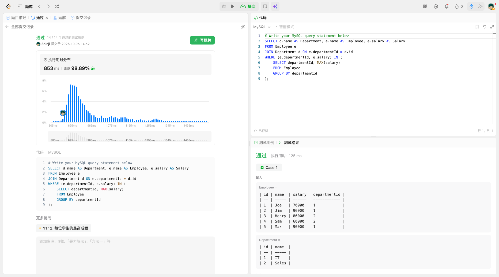

---

## 596. Classes With at Least 5 Students

```sql
SELECT class
FROM Courses
GROUP BY class
HAVING COUNT(student) >= 5;
```

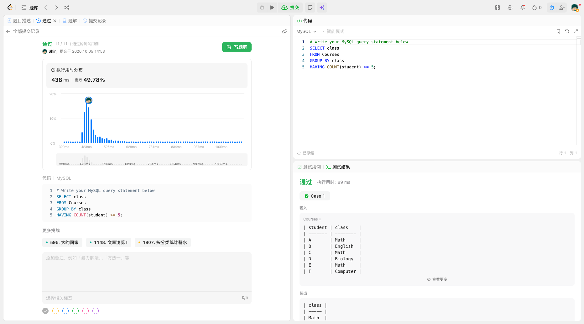

---

# API Design

---

## Question 1. 

GraphQL is an alternative API style that lets clients request specific fields through a strongly defined schema. Clients send queries (to read) and mutations (to write), usually to a single endpoint, and the server returns exactly the fields that were asked for.

---

## Question 2. 

Different clients may need different views of the same data. For example, a mobile order screen may need only the order status and user name, while an admin portal needs much more. With REST the server defines the response shape, so clients either receive fields they do not need or must call several resource URLs to assemble one screen. GraphQL lets the client select the fields it needs in one request, and its strong schema gives tooling and introspection for frontends with varied data needs.

---

## Question 3. 

1. Define a schema: the types, fields, queries, and mutations the API supports.
2. Implement resolvers on the server that fetch the data for each field.
3. The client sends a query (read) or a mutation (write) to the single GraphQL endpoint and lists the fields it wants.
4. The server returns JSON with the same shape as the query.

```graphql
query {
  order(id: 123) {
    status
    user {
      name
    }
  }
}
```

Considerations:

- A small query can trigger expensive backend work.
- Authorization must be enforced for types and fields.
- Nested resolvers can cause the N+1 problem: one query for orders, then one query per order's user or items. Use batching and request-scoped loaders.
- Use query-depth limits and cost limits.

---

## Question 4. 

| REST | GraphQL |
| --- | --- |
| Many resource URLs | Commonly one endpoint |
| Server defines response shape | Client selects fields |
| Uses HTTP methods/status semantics directly | Uses queries and mutations |
| Straightforward HTTP caching | Field/query-aware caching is more involved |
| Simple operational model | Flexible but adds query complexity |

REST strengths: simple mental model and HTTP semantics, easy observability and caching, common for service-to-service APIs.

GraphQL strengths: flexible client-selected fields, strong schema, tooling, and introspection, useful for frontends with varied data needs.
