# API Design Homework

## Question 1: What is GraphQL

GraphQL is an API query language where the client specifies the exact shape of the data it needs. Unlike REST, where the server defines fixed response structures for each endpoint, GraphQL lets the client request specific fields and related objects through an API schema.

## Question 2: What problems GraphQL is trying to sovle?

GraphQL mainly solves the problem that different clients have different data requirements by solving the over-fetching and under-fetching issues. REST endpoints often return either too much data or force clients to make multiple requests. GraphQL lets each client request exactly the fields and relationships it needs, which is especially useful to satisfy different clients' different data needs.

## Question 3: How to use GraphQL?

On the server, we define a strongly typed GraphQL schema containing types, queries, and mutations. The client sends a query specifying which fields it wants. The server executes resolvers that fetch the corresponding data from databases or downstream services and returns a response matching the client's requested structure

## Question 4: What are the differences between REST and GraphQL?

REST models APIs around resources and typically exposes multiple endpoints with server-defined response structures. GraphQL usually exposes a single endpoint backed by a typed schema and lets the client request exactly the fields and relationships it needs. GraphQL is particularly useful for avoiding over-fetching and under-fetching and for supporting clients with different data requirements. However, it adds complexity around caching, authorization, query cost, and N+1 queries, so I would normally default to REST unless the flexibility of GraphQL provides a clear benefit.

# Database Homework

## 175

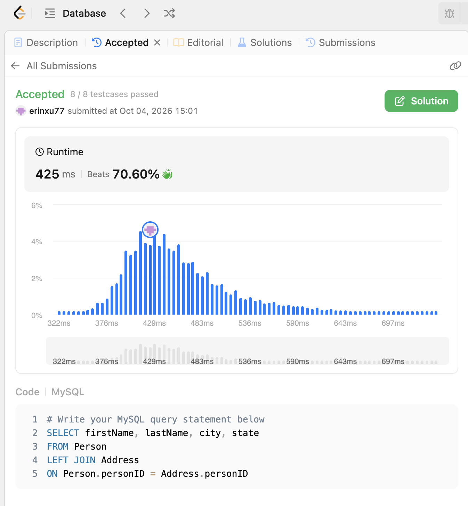

## 176

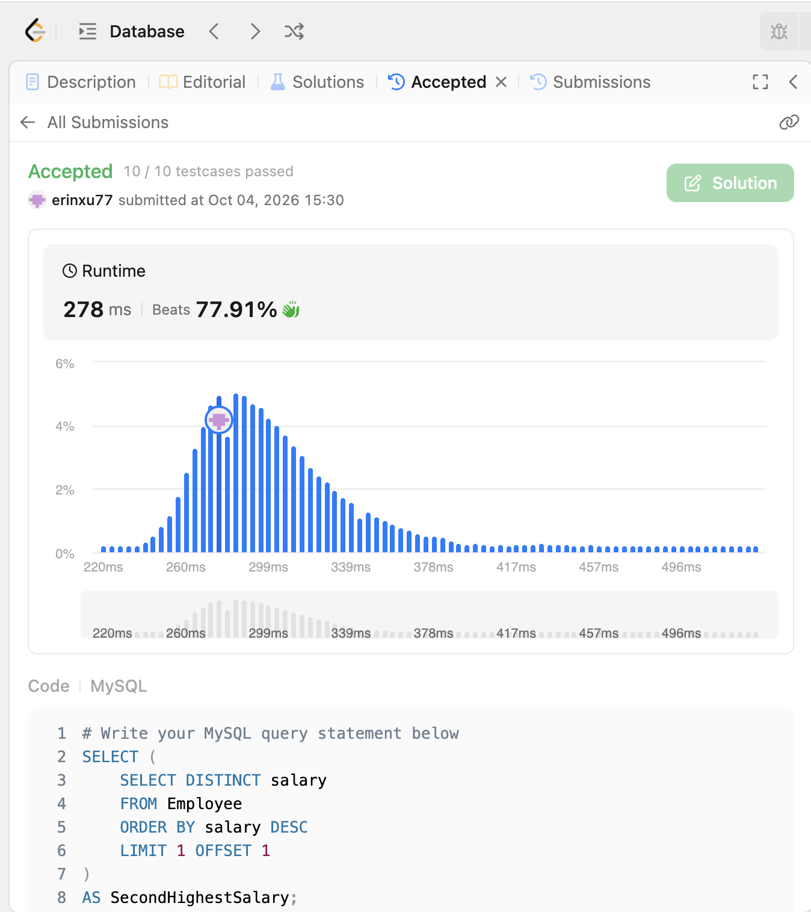

## 1757

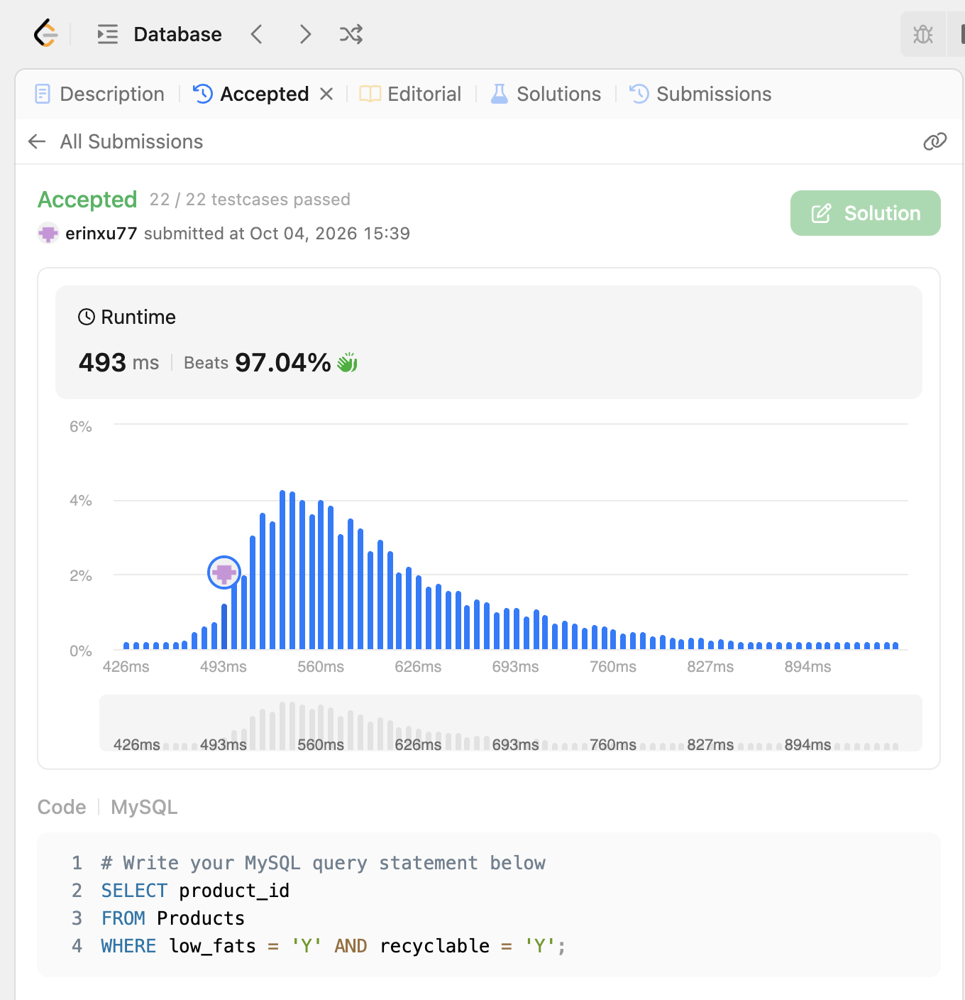

## 181

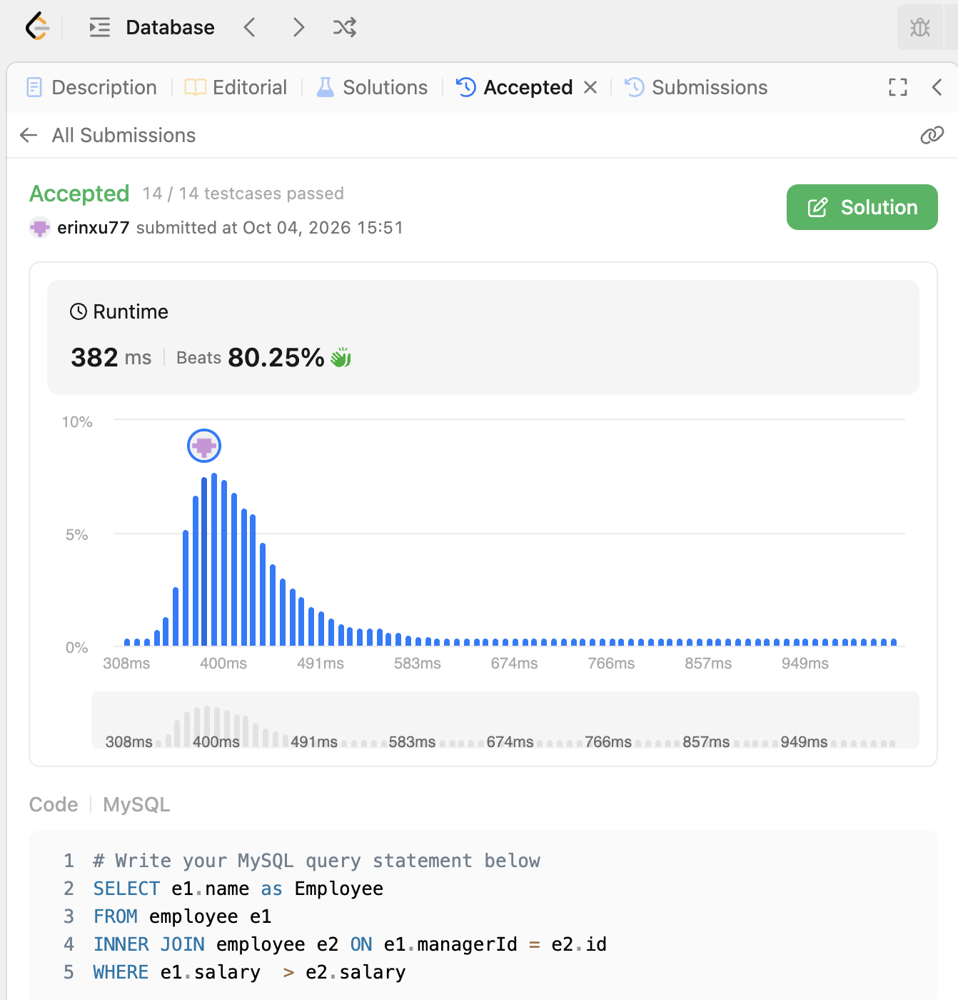

## 180

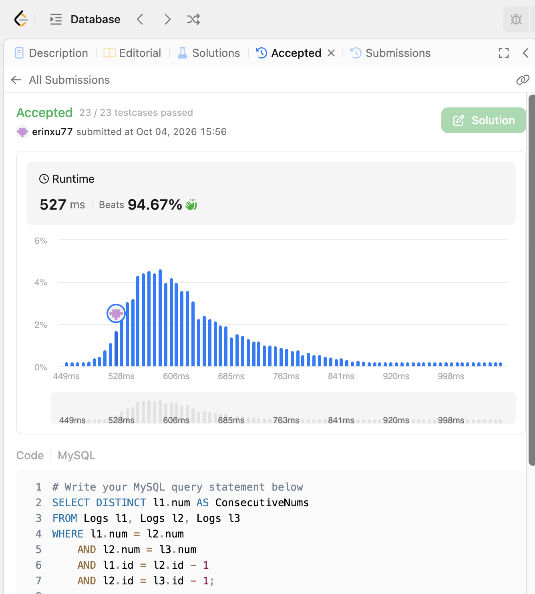

## 196

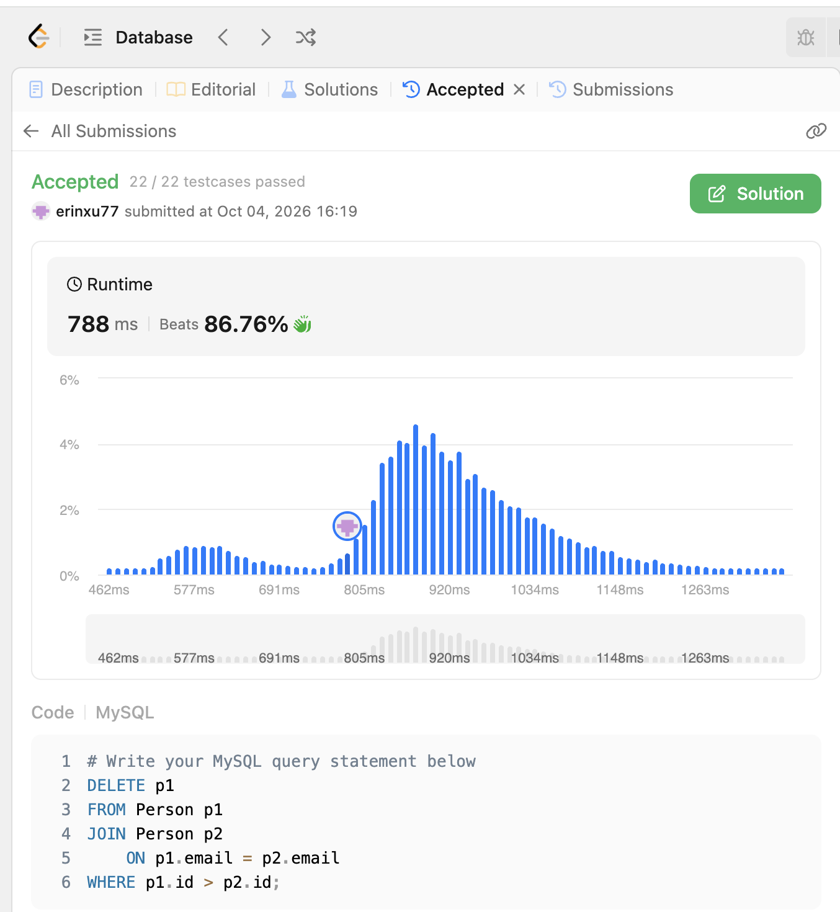

## 183

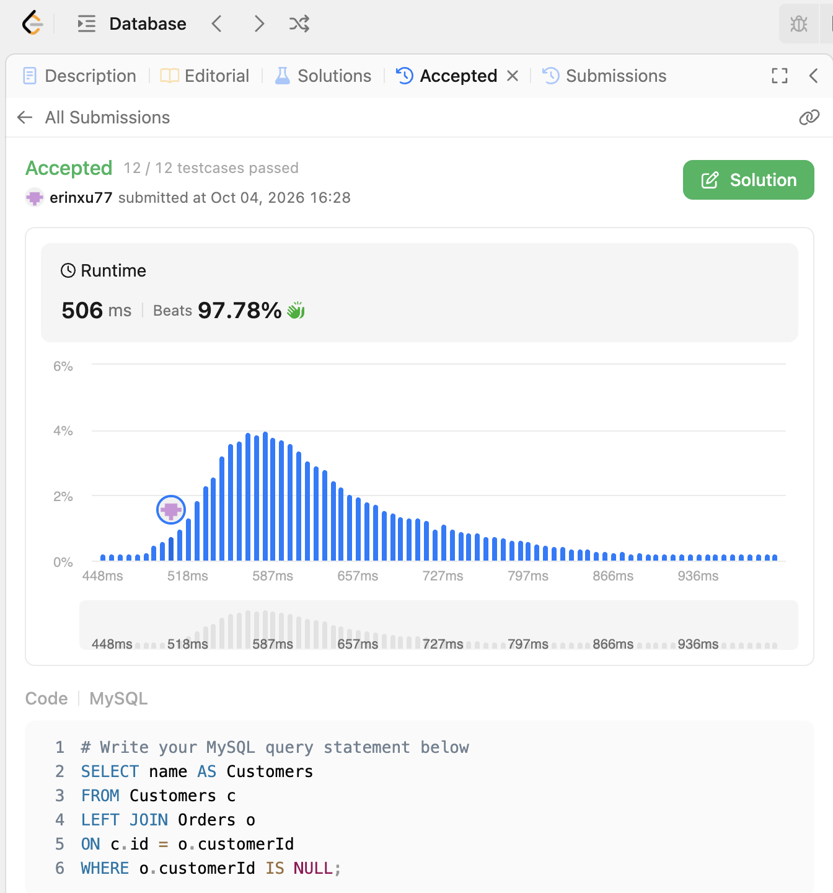

## 584

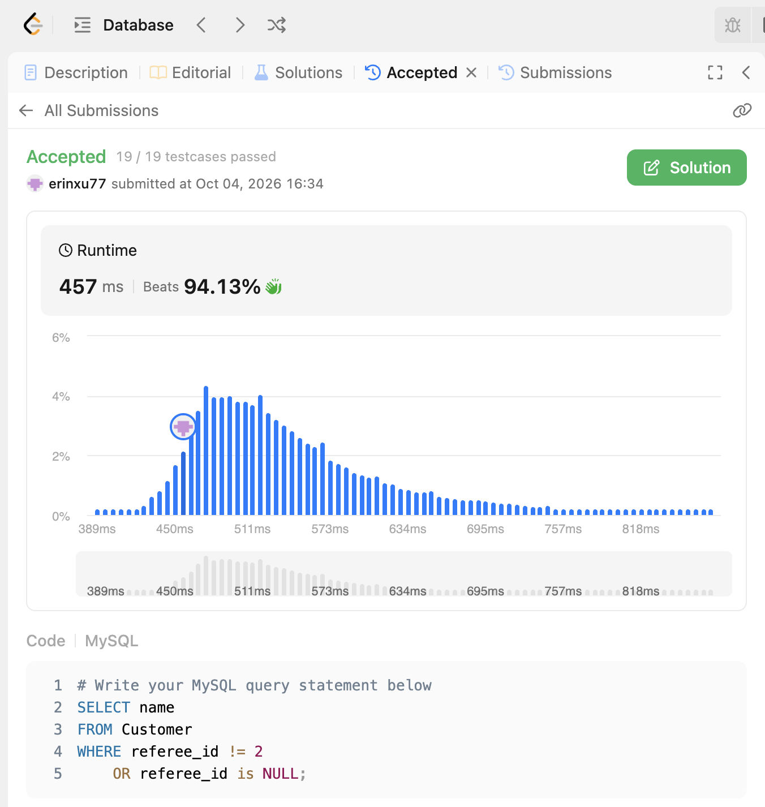

## 595

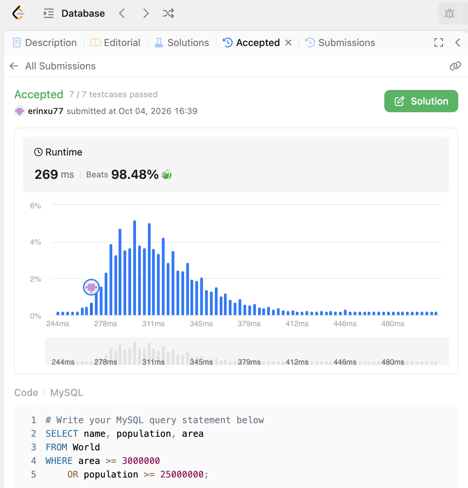

## 184

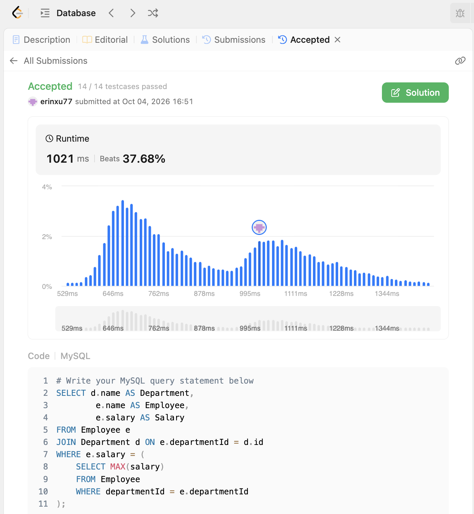

## 596

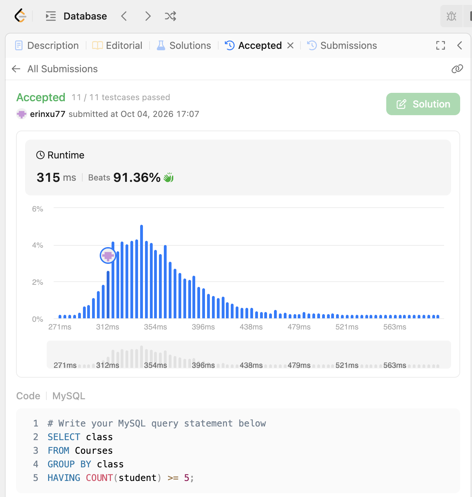
